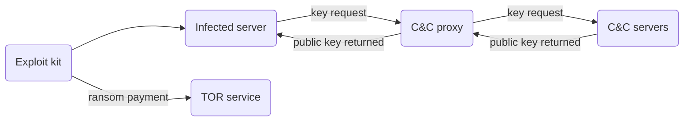
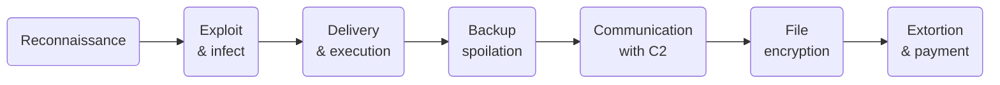
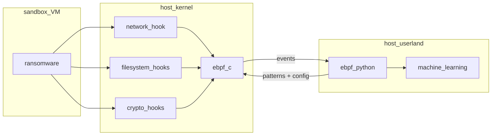
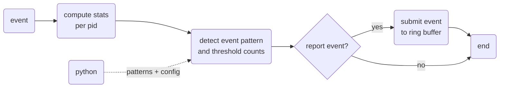

# OT Project

## Overview

The aim of this project is to detect Linux malware, stegomalware, ransomware, cryptojacking, or cryptoworms using eBPF.

## Anathomy of ransomware

## Stages in ransomware attacks

## Setup

- Host VM
  - Linux Ubuntu 22.04?
  - virtual switch
  - bpf network tracing
  - bpf userspace program
  - malware detection tools (eg https://docs.remnux.org/, https://github.com/mandiant/flare-fakenet-ng)

- Guest VM
  - Linux Ubuntu 22.04?
  - Malware/Ransomware
  - bpf syscall tracing

For the initial software installation, the default NAT networking is used:
[default configuration](https://access.redhat.com/webassets/avalon/d/Red_Hat_Enterprise_Linux-7-Virtualization_Deployment_and_Administration_Guide-en-US/images/107d0a45e24f098d2ea64be62898e9dc/vn-08-network-overview.png)

Once installed, the isolated mode is used for testing malware/ransomeware:
[isolated mode](https://access.redhat.com/webassets/avalon/d/Red_Hat_Enterprise_Linux-7-Virtualization_Deployment_and_Administration_Guide-en-US/images/ad58f56e3f39b5ffa9271100b3ccfe7d/vn-07-isolated-switch.png)

## Detection methods

Based on litterature, the following detection methods seem relevant:

- detect traffic to/from C2
  - protocols: DNS, HTTP
  - patterns: 
    - DNS: pseudo-random domain names generated by DGA algorithm (example https://github.com/philarkwright/DGA-Detection)
    - HTTP: URLs, user agents, blacklisted proxy servers, more POST than GET 
    - TCP: connection resets
    - IPv6: headers used by covert channels (example: flow label)
  - how: socket, TC or XDP hook on virbr0 interface (probably TC is best to access sk_buff structure)
  - references: 1, 3, 4, 5, 8, 10

- detect file read/write activity during encryption
  - patterns: RW frequency, RW in sequence, data buffer entropy, file type changes, chmod
  - how: open/openat, read, write, unlink/unlinkat syscall - tracepoint or fprobe (better than kprobe)
  - references: 1, 2, 4, 5, 10, 11

- detect encryption
  - patterns: high CPU/RAM usage, disk read/write, crypto libraries?
  - how: 
    - linux crypto API (socket interface see https://www.kernel.org/doc/html/latest/crypto/index.html)
    - https://ubuntu.com/server/docs/introduction-to-crypto-libraries ?
    - uprobes or USDT probes on shared libraries like OpenSSL, GnuTLS, NSS, GnuPG, crypto++, gcrypt... (see https://ssimo.org/slides/devconf-2020-crypto-ebpf.pdf)
    - check also https://github.com/s41m0n/eBPF_TrafficAnalyzer
  - references: 6, 7

- detect backup/file spoilation (mostly linux desktop)
  - patterns: sensitive linux files deletion, user document file deletion, delete cloud storage
  - how: unlink/unlinkat syscall - tracepoint or fprobe (better than kprobe)
  - references: 11

- static analysis (file scanning)
  - patterns: file content, keywords
  - how: read syscall hook - tracepoint or fprobe (better than kprobe)
  - references: 4, 5

- ransomware targeting VMware ESXi
  - patterns: list vms, kill vms, encyrpt vm disks
  - how: 
    - same as above focus on specific file/file extensions
    - trace command execution (`esxcli vm process list`, `esxcli vm process kill`...)
  - references: 12

## Software architecture

### eBPF C program

## References

1. UNVEIL: A Large-Scale, Automated Approach to Detecting Ransomware
2. Toward A Network-Assisted Approach for Effective Ransomware Detection
3. Software-Defined Networking-based Crypto Ransomware Detection Using HTTP Traffic Characteristics
4. Ransomware Detection and Classification Strategies
5. Ransomware Detection techniques in the Dawn of Artificial Intelligence: A Survey
6. PayBreak: Defense Against Cryptographic Ransomware
7. Checking yourcryptography usage with eBPF (redhat, devconf 2020)
8. A Multi-Classifier Network-based Crypto Ransomware Detection System: A Casestudy of Locky Ransomware
9. A flow-based IDS using Machine Learning in eBPF
10. Kernel-level tracing for detecting stegomalware and covert channels in Linux environments
11. CryptoLock (and Drop It): Stopping Ransomware Attacks on User Data
12. https://www.bleepingcomputer.com/news/security/linux-version-of-rtm-locker-ransomware-targets-vmware-esxi-servers/ 
    https://blogs.vmware.com/security/2022/02/avoslocker-modern-linux-ransomware-threats.html
    https://www.uptycs.com/blog/rtm-locker-ransomware-as-a-service-raas-linux (see yara rule)
