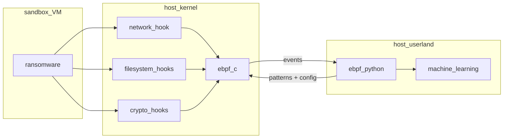
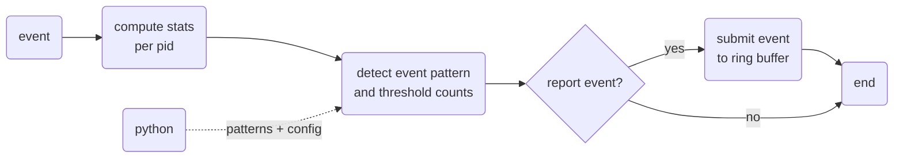

# ebpfangel - Ransomware Detection using Machine Learning with eBPF for Linux

Authors: [Max Willers](https://www.linkedin.com/in/max-willers-53830b268), [Tomás Philippart](https://www.linkedin.com/in/tomasphilippart/)

This is the final result of an Offensive Technologies research project for the MSc Security and Network Engineering program of the University of Amsterdam. This is not intended to be a final product/solution to use in any productions environment whatsoever, it is simply the byproduct of research and therefore is intended to use as so. 

[Slides](https://github.com/TomasPhilippart/ebpfangel/blob/main/docs/ebpfangel-presentation.pdf), [Paper](https://github.com/TomasPhilippart/ebpfangel/blob/main/docs/Ransomware_Detection_using_Machine_Learning_with_eBPF.pdf)

## Software architecture

### eBPF C program

## Learning resources and references

### In Proceedings

- [UNVEIL: A Large-Scale, Automated Approach to Detecting Ransomware](https://dl.acm.org/doi/10.1145/2976749.2978380) (Kharraz et al., 2016-08)

- [A Multi-Classifier Network-Based Crypto Ransomware Detection System: A Case Study of Locky Ransomware](https://ieeexplore.ieee.org/document/8676353) (Almashhadani et al., 2019-03)

### Articles

- [Ransomware: Recent advances, analysis, challenges and future research directions](https://www.sciencedirect.com/science/article/pii/S016740482100314X) (Beaman et al., 2021-12)

- [Ransomware deployment methods and analysis: views from a predictive model and human responses](https://doi.org/10.1186/s40163-019-0097-9) (Hull et al., 2019-02)

- [An empirical study of ransomware attacks on organizations: an assessment of severity and salient factors affecting vulnerability](https://doi.org/10.1093/cybsec/tyaa023) (Yuryna Connolly et al., 2020-01-01)

- [Introduction of the ARDS—Anti-Ransomware Defense System Model—Based on the Systematic Review of Worldwide Ransomware Attacks](https://www.mdpi.com/2076-3417/11/13/6070) (Szücs et al., 2021-01)

- [The rise of ransomware: Forensic analysis for windows based ransomware attacks](https://www.sciencedirect.com/science/article/pii/S0957417421015141) (Kara & Aydos, 2022-03-15)

- [Ransomware detection using machine learning algorithms](https://onlinelibrary.wiley.com/doi/abs/10.1002/cpe.5422) (Bae et al., 2020)

- [A comprehensive survey on deep learning based malware detection techniques](https://www.sciencedirect.com/science/article/pii/S1574013722000636) (Gopinath & Chakkaravarthy Sethuraman, 2023-02-01)

- [A behavioral analysis of the ransomware strain NEFILIM](https://doi.org/10.13140/RG.2.2.18301.59360) (Groenewegen et al., 2020-10-25)

### Online Resources

- [The State of Ransomware 2022](https://www.sophos.com/en-us/content/state-of-ransomware) (SOPHOS, 2022-04)

- [IceFire ransomware now encrypts both Linux and Windows systems](https://www.bleepingcomputer.com/news/security/icefire-ransomware-now-encrypts-both-linux-and-windows-systems/) (Gatlan, 2023-03-09)

- [What is eBPF? An Introduction and Deep Dive into the eBPF Technology](https://www.ebpf.io/what-is-ebpf/)

- [BCC](https://liuhangbin.netlify.app/post/ebpf-and-xdp/) (IO Visor Project)

